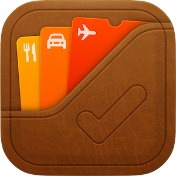

<h1>Budgot</h1>

Really simple budgeting app.

<h2>How to install (basic)</h2>

1. Pick up your phone.
2. Open Safari.
3. Go to <a href="https://get-buddy.vercel.app/">https://get-buddy.vercel.app/</a>
4. Using the `Share menu` press `Add to Home Screen`
5. Add to your home screen.
6. Yay now you have this as an app on your phone.

<h2>Advanced streamlining (high IQs only)</h2>

Configure an iOS Shortcut to open a URL using <code>webapp://get-buddy.vercel.app/</code>, then configure your action button (if you have it) to run that shortcut.

Now you can quick-open the app with your action button :)

<h2>FAQ</h2>

<h3>Is this free to use?</h3>

Yes.

<h3>Really? Free? In this economy? What's the catch?</h3>

The app is currently optimized for what I  want, so if you want to change anything you gotta fork this project and do it yourself.

<h3>Can I edit the available categories?</h3>

No. Sorry.

<h3>What if I love this so much I want to pay for it?</h3>

I'm flattered however unsurprised (people often want to give me money). If you ever see me in person, I'd accept some cash.

